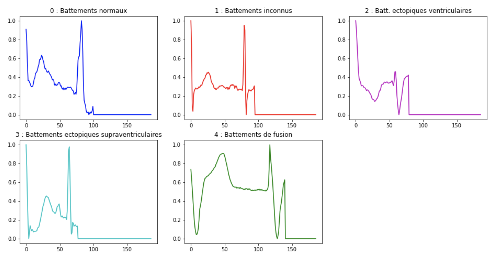

# Projet de Classification des Battements Cardiaques par Analyse ECG

Ce projet vise à classifier automatiquement les battements cardiaques en **5 catégories** à partir de signaux ECG, en combinant des méthodes d'apprentissage supervisé, non supervisé et de réduction de dimension.


- [Méthodologie](#méthodologie)
  - [Partie I : DTW  par-asmae](https://github.com/AsmaeKarmouchi/Project_ECG_Classification/blob/main/Projet_ECG_Etudiant_new%20(3).ipynb)
  - [Partie II : Classification sans prétraitement  par-alban](https://github.com/AsmaeKarmouchi/Project_ECG_Classification/blob/main/Projet_ECG_Etudiant_new%20(3).ipynb)
  - [Partie III : Classification avec ACP  par-asmae](https://github.com/AsmaeKarmouchi/Project_ECG_Classification/blob/main/Projet_ECG_Etudiant_new%20(3).ipynb)

---

## 📊 Jeu de données
- **Source** : Base de données [MIT-BIH Arrhythmia]


On distingue 5 battements cardiaques différents : Battements normaux', 'Battements inconnus', 'Battements ectopiques ventriculaires', 'Battements ectopiques supraventriculaires' et 'Battements de fusion'.

De ces signaux, on extrait des caractéristiques par la librairie TSFEL - *Time Series Features Extraction Library* (https://tsfel.readthedocs.io/en/latest/index.html)

Les 156 caractéristiques extraites sont divisées selon les domaines :
- temporel avec 31 caractéristiques comme l'entropie, Max, Min, Absolute Energy ...
- statistique avec 14 caractéristiques comme écart moyen absolu, écart médian, variance, Kurtosis...
- spectral  avec 111 caractéristiques comme les coefficients FFT par bande de fréquence, ondelettes...

Lien vers le papier expliquant TSFEL : https://www.sciencedirect.com/science/article/pii/S2352711020300017

---
## 🎯 Objectifs
- **Classifier 5 types de battements** :  
  `Normaux`, `Inconnus`, `Ectopiques ventriculaires`, `Ectopiques supraventriculaires`, `Fusion`.
- Comparer les performances des approches **supervisées** (Random Forest, KNN) et **non supervisées** (K-means, Clustering Hiérarchique).
- Analyser l’impact de la **réduction de dimension** (ACP) et des **types de caractéristiques** (temporelles, spectrales, statistiques).

---


## 💻 Installation
1. Clonez le dépôt :
   ```bash
   git clone https://github.com/AsmaeKarmouchi/Project_ECG_Classification.git

2. Installez les dépendances :
   ```bash
    pip install -r requirements.txt


## 👥 Contributeurs

Asmae KARMOUCHI :
➔ DTW, Classification avec ACP.

Alban PERSONNAZ :
➔ Classification sans ACP, optimisation des modèles.
